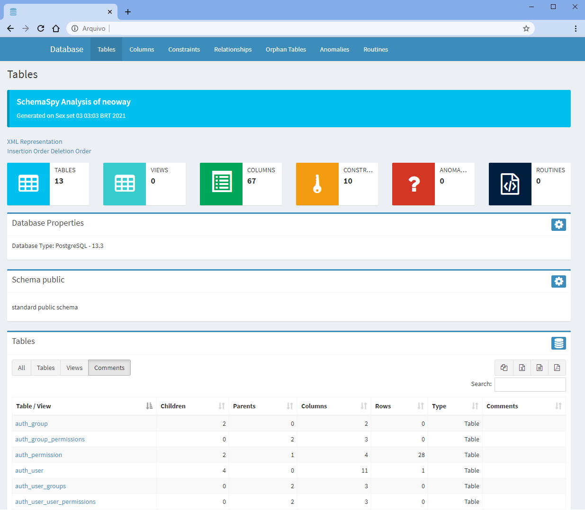

# SchemaSpy
Documentar banco de dados

## Requisitos
- [Java 8](https://java.com/en/download/manual.jsp)
- [Graphviz](https://github.com/jvsouza/schemaspy/graphviz-2.38.rar)
- [PosgreSQL](https://github.com/jvsouza/schemaspy/postgresql-42.2.23.jar)
- [SchemaSpy](https://github.com/jvsouza/schemaspy/schemaspy-6.1.0.jar)

## Estrutura resumida de pastas e arquivos
```text

SchemaSpy
├── graphviz-2.38/
│   ├── bin/
│   ├── etc/
│   .
│   .
│   .
│   └── shared/
├── output/
├── postgresql-42.2.23
├── schemaspy.properties
└── schemaspy-6.1.0.jar

```

## Instalação
- Descompactar o `graphviz-2.38.rar`;
- Disponibilizar o `postgresql-42.2.23.jar`;
- Configurar o `schemaspy.properties`;
- Disponibilizar o `schemaspy-6.1.0.jar`;

## Configuração
Definir os parâmetros do banco de dados e localização dos arquivos `Graphviz` e `PosgreSQL` em `shemaspy.properties`.
```py
	# type of database. Run with -dbhelp for details
	schemaspy.t=pgsql
	# host 
	schemaspy.host=localhost
	# port number
	schemaspy.port=5432
	# dabase name
	schemaspy.db=dbparts
	# username
	schemaspy.u=user123
	# password
	schemaspy.p=123456
	# output dir to save generated files
	schemaspy.o=output
	# db scheme for which generate diagrams
	schemaspy.s=public
	# path and file to .jar postgres
	schemaspy.dp=postgresql-42.2.23.jar
	# just path to folder graphviz 
	schemaspy.gv=graphviz
```

## Execução
```sh
	java -jar schemaspy-6.1.0.jar -vizjs
```

## Resultado


## Referências
- https://schemaspy.org
- https://schemaspy.readthedocs.io/
